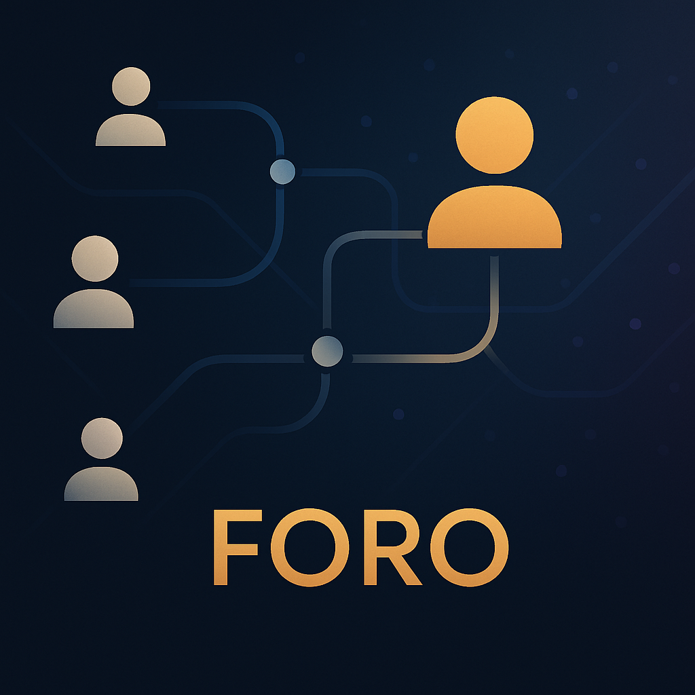

## Hi there 👋

# ¡Hola! Soy Benjamin Ordaz 👋
Soy **Estudiante de Ingeniería en Computación** y apasionado por el desarrollo de software. Me encanta trabajar en proyectos que combinan **inteligencia artificial**, **desarrollo web full stack**, **algoritmos**. Actualmente sigo aprendiendo y creciendo como programador.

## 🚀 Tecnologías que utilizo:

- **Lenguajes**: Python, JavaScript (Node.js, Express), TypeScript
- **Frameworks**: NestJS, React, Expo
- **Base de Datos**: MongoDB, Firebase
- **Herramientas**: Git, GitHub
- **Desarrollo de Software**: Desarrollo ágil, TDD, CI/CD

## 📈 Lenguajes más utilizados:

## 🔧 Herramientas que utilizo:

- 
- 
- 

## 📫 ¿Cómo contactarme?

- **Correo**: [benjamin.ordaz@example.com](mailto:benjamin.ordaz@example.com)
- **LinkedIn**: [https://linkedin.com/in/benjamin-ordaz](https://linkedin.com/in/benjamin-ordaz)
- **Twitter**: [@Benjamín Ordaz](https://twitter.com/BenjamínOrdaz)

- ## 📂 Ultimos proyectos:
### 1. [Juego Secreto](./assets/chatbot.png)

**Tecnologías**: NestJS, MongoDB, TypeScript
